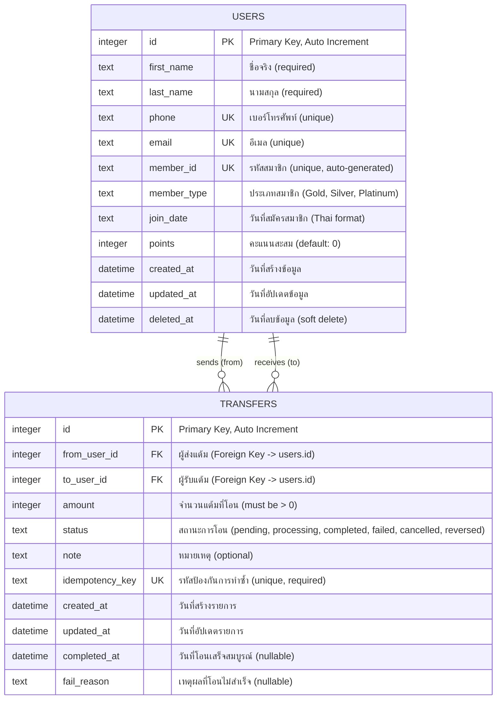
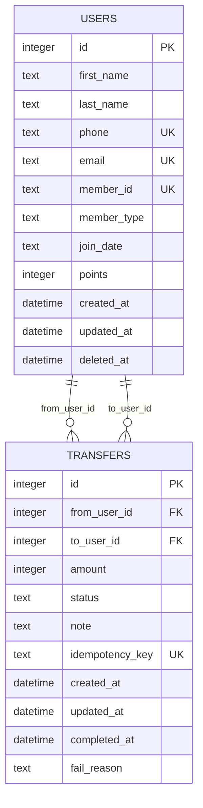

# PayFlow Database - Entity Relationship Diagram

## Interactive ER Diagram

View this diagram in [Mermaid Live Editor](https://mermaid.live/) or GitHub (automatic rendering)



## Legend

| Symbol | Meaning |
|--------|---------|
| `PK` | Primary Key |
| `FK` | Foreign Key |
| `UK` | Unique Key |
| `\|\|--o{` | One-to-Many relationship |

## Relationships Explained

### 1. USERS sends TRANSFERS (One-to-Many)
- **Type**: `||--o{` (One user can send zero or many transfers)
- **From**: `USERS.id`
- **To**: `TRANSFERS.from_user_id`
- **Description**: ผู้ใช้งาน 1 คนสามารถส่งแต้มได้หลายครั้ง

### 2. USERS receives TRANSFERS (One-to-Many)
- **Type**: `||--o{` (One user can receive zero or many transfers)
- **From**: `USERS.id`
- **To**: `TRANSFERS.to_user_id`
- **Description**: ผู้ใช้งาน 1 คนสามารถรับแต้มได้หลายครั้ง

## Cardinality Notation

```
||--o{  = One to Zero or Many
||--|{  = One to One or Many
}o--o{  = Zero or Many to Zero or Many
||--||  = One to One
}o--||  = Zero or Many to One
```

## SQL Schema

### Create Tables

```sql
-- Users Table
CREATE TABLE users (
    id INTEGER PRIMARY KEY AUTOINCREMENT,
    first_name TEXT NOT NULL,
    last_name TEXT NOT NULL,
    phone TEXT NOT NULL UNIQUE,
    email TEXT NOT NULL UNIQUE,
    member_id TEXT NOT NULL UNIQUE,
    member_type TEXT,
    join_date TEXT,
    points INTEGER DEFAULT 0,
    created_at DATETIME NOT NULL,
    updated_at DATETIME NOT NULL,
    deleted_at DATETIME
);

-- Transfers Table
CREATE TABLE transfers (
    id INTEGER PRIMARY KEY AUTOINCREMENT,
    from_user_id INTEGER NOT NULL,
    to_user_id INTEGER NOT NULL,
    amount INTEGER NOT NULL CHECK (amount > 0),
    status TEXT NOT NULL CHECK (status IN ('pending','processing','completed','failed','cancelled','reversed')),
    note TEXT,
    idempotency_key TEXT NOT NULL UNIQUE,
    created_at DATETIME NOT NULL,
    updated_at DATETIME NOT NULL,
    completed_at DATETIME,
    fail_reason TEXT,
    FOREIGN KEY (from_user_id) REFERENCES users(id) ON DELETE RESTRICT,
    FOREIGN KEY (to_user_id) REFERENCES users(id) ON DELETE RESTRICT
);

-- Indexes
CREATE INDEX idx_users_deleted_at ON users(deleted_at);
CREATE INDEX idx_transfers_from ON transfers(from_user_id);
CREATE INDEX idx_transfers_to ON transfers(to_user_id);
CREATE INDEX idx_transfers_created ON transfers(created_at);
```

## Alternative View: Detailed Relationships



## Visual Representation

```
┌─────────────────┐                    ┌──────────────────┐
│     USERS       │                    │    TRANSFERS     │
├─────────────────┤                    ├──────────────────┤
│ id (PK)         │◄───────────────────│ from_user_id (FK)│
│ first_name      │                    │ to_user_id (FK)  │
│ last_name       │◄───────────────────│ amount           │
│ phone (UK)      │                    │ status           │
│ email (UK)      │                    │ idempotency_key  │
│ member_id (UK)  │                    │ ...              │
│ points          │                    └──────────────────┘
│ ...             │
└─────────────────┘
     1      0..*
     └──────────┘
    sends/receives
```

## How to View

### Option 1: GitHub
Just push this file to GitHub and it will render automatically!

### Option 2: Mermaid Live Editor
1. Copy the mermaid code block
2. Go to https://mermaid.live/
3. Paste the code
4. View and export as PNG/SVG

### Option 3: VS Code
Install "Markdown Preview Mermaid Support" extension

### Option 4: Local Tools
- Use `mermaid-cli` (mmdc) to generate images
```bash
npm install -g @mermaid-js/mermaid-cli
mmdc -i ER-diagram.md -o er-diagram.png
```

## Notes

- This ER diagram follows the [Mermaid ER Diagram syntax](https://docs.mermaidchart.com/mermaid-oss/syntax/entityRelationshipDiagram.html)
- Rendered automatically on GitHub, GitLab, and many documentation platforms
- Can be exported to PNG, SVG, or PDF using Mermaid tools

---

**Created**: 2025-10-17  
**Database**: SQLite 3  
**ORM**: GORM v1.31.0  
**Documentation**: [database.md](database.md)
