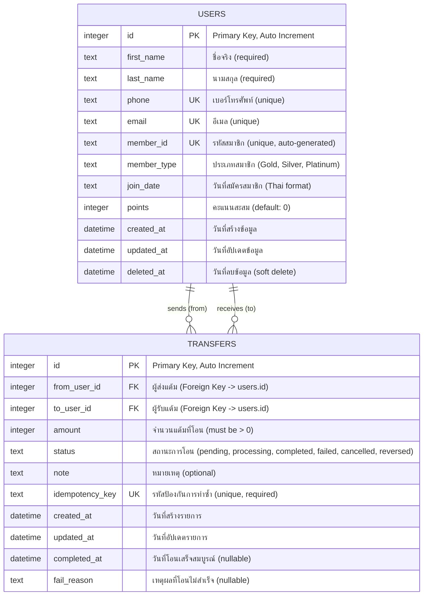

# PayFlow Database Design

## Entity Relationship Diagram



## Table Details

### 👤 USERS Table

**Purpose**: เก็บข้อมูลผู้ใช้งานและคะแนนสะสม

| Column | Type | Constraints | Description |
|--------|------|-------------|-------------|
| `id` | INTEGER | PRIMARY KEY, AUTO_INCREMENT | รหัสผู้ใช้งาน |
| `first_name` | TEXT | NOT NULL | ชื่อจริง |
| `last_name` | TEXT | NOT NULL | นามสกุล |
| `phone` | TEXT | NOT NULL, UNIQUE | เบอร์โทรศัพท์ |
| `email` | TEXT | NOT NULL, UNIQUE | อีเมล |
| `member_id` | TEXT | NOT NULL, UNIQUE | รหัสสมาชิก (เช่น LBK001234) |
| `member_type` | TEXT | | ประเภทสมาชิก (Gold, Silver, Platinum) |
| `join_date` | TEXT | | วันที่สมัครสมาชิก (รูปแบบไทย เช่น 15/6/2566) |
| `points` | INTEGER | DEFAULT 0 | คะแนนสะสมปัจจุบัน |
| `created_at` | DATETIME | NOT NULL | วันที่สร้างข้อมูล |
| `updated_at` | DATETIME | NOT NULL | วันที่อัปเดตข้อมูลล่าสุด |
| `deleted_at` | DATETIME | | วันที่ลบข้อมูล (soft delete) |

**Indexes**:
- `idx_users_deleted_at` - Index on deleted_at for soft delete queries

**Business Rules**:
- Member ID auto-generated เป็น `LBK + 6 digits` ถ้าไม่ระบุ
- Member Type default เป็น `Gold` ถ้าไม่ระบุ
- Join Date default เป็นวันที่ปัจจุบัน (รูปแบบไทย) ถ้าไม่ระบุ
- Points ไม่สามารถติดลบได้ (validated in business logic)

### 💸 TRANSFERS Table

**Purpose**: เก็บประวัติการโอนแต้มระหว่างผู้ใช้งาน

| Column | Type | Constraints | Description |
|--------|------|-------------|-------------|
| `id` | INTEGER | PRIMARY KEY, AUTO_INCREMENT | รหัสรายการโอน |
| `from_user_id` | INTEGER | NOT NULL, FOREIGN KEY | ผู้ส่งแต้ม (references users.id) |
| `to_user_id` | INTEGER | NOT NULL, FOREIGN KEY | ผู้รับแต้ม (references users.id) |
| `amount` | INTEGER | NOT NULL, CHECK (amount > 0) | จำนวนแต้มที่โอน (ต้องมากกว่า 0) |
| `status` | TEXT | NOT NULL, CHECK (status IN (...)) | สถานะการโอน |
| `note` | TEXT | | หมายเหตุหรือข้อความ |
| `idempotency_key` | TEXT | NOT NULL, UNIQUE | รหัสป้องกันการทำซ้ำ (ใช้เป็น id ใน GET /transfers/{id}) |
| `created_at` | DATETIME | NOT NULL | วันที่สร้างรายการโอน |
| `updated_at` | DATETIME | NOT NULL | วันที่อัปเดตรายการล่าสุด |
| `completed_at` | DATETIME | | วันที่โอนเสร็จสมบูรณ์ |
| `fail_reason` | TEXT | | เหตุผลที่โอนไม่สำเร็จ (กรณี status = failed) |

**Indexes**:
- `idx_transfers_from` - Index on from_user_id
- `idx_transfers_to` - Index on to_user_id  
- `idx_transfers_created` - Index on created_at
- `unique_idempotency_key` - Unique index on idempotency_key

**Foreign Keys**:
- `from_user_id` → `users.id` (ON DELETE RESTRICT)
- `to_user_id` → `users.id` (ON DELETE RESTRICT)

**Status Values**:
- `pending` - รอดำเนินการ
- `processing` - กำลังดำเนินการ
- `completed` - โอนสำเร็จ
- `failed` - โอนไม่สำเร็จ
- `cancelled` - ยกเลิกการโอน
- `reversed` - ย้อนกลับการโอน

**Business Rules**:
- `from_user_id` และ `to_user_id` ต้องไม่เหมือนกัน (ไม่สามารถโอนให้ตัวเองได้)
- `amount` ต้องมากกว่า 0
- ผู้ส่งต้องมีแต้มเพียงพอ (checked before creating transfer)
- `idempotency_key` ใช้ป้องกันการโอนซ้ำ (same key returns same transfer)
- เมื่อ status = `completed` จะมี `completed_at` timestamp
- เมื่อ status = `failed` จะมี `fail_reason` อธิบายสาเหตุ

## Relationships

### 1. USERS → TRANSFERS (One-to-Many: Sender)
- **Cardinality**: 1 User → 0..* Transfers (as sender)
- **Description**: ผู้ใช้งานหนึ่งคนสามารถส่งแต้มได้หลายครั้ง
- **Foreign Key**: `transfers.from_user_id` → `users.id`
- **Delete Rule**: RESTRICT (ไม่สามารถลบ user ที่มี transfer ได้)

### 2. USERS → TRANSFERS (One-to-Many: Receiver)
- **Cardinality**: 1 User → 0..* Transfers (as receiver)
- **Description**: ผู้ใช้งานหนึ่งคนสามารถรับแต้มได้หลายครั้ง
- **Foreign Key**: `transfers.to_user_id` → `users.id`
- **Delete Rule**: RESTRICT (ไม่สามารถลบ user ที่มี transfer ได้)

## Database Constraints

### CHECK Constraints

```sql
-- TRANSFERS table
CHECK (amount > 0)
CHECK (status IN ('pending', 'processing', 'completed', 'failed', 'cancelled', 'reversed'))
```

### UNIQUE Constraints

```sql
-- USERS table
UNIQUE (phone)
UNIQUE (email)
UNIQUE (member_id)

-- TRANSFERS table
UNIQUE (idempotency_key)
```

### FOREIGN KEY Constraints

```sql
FOREIGN KEY (from_user_id) REFERENCES users(id) ON DELETE RESTRICT
FOREIGN KEY (to_user_id) REFERENCES users(id) ON DELETE RESTRICT
```

## Query Patterns

### Common Queries

#### 1. Get User with Total Points
```sql
SELECT id, first_name, last_name, points 
FROM users 
WHERE deleted_at IS NULL 
  AND id = ?;
```

#### 2. Get Transfer History for User
```sql
SELECT * FROM transfers 
WHERE (from_user_id = ? OR to_user_id = ?)
ORDER BY created_at DESC
LIMIT ? OFFSET ?;
```

#### 3. Check Idempotency
```sql
SELECT * FROM transfers 
WHERE idempotency_key = ?;
```

#### 4. Get Completed Transfers
```sql
SELECT t.*, 
       u_from.first_name as sender_name,
       u_to.first_name as receiver_name
FROM transfers t
LEFT JOIN users u_from ON t.from_user_id = u_from.id
LEFT JOIN users u_to ON t.to_user_id = u_to.id
WHERE t.status = 'completed'
  AND t.created_at >= ?
ORDER BY t.created_at DESC;
```

## Transaction Example

### Transfer Points Transaction

```sql
BEGIN TRANSACTION;

-- 1. Create transfer record
INSERT INTO transfers (
  from_user_id, to_user_id, amount, status, 
  note, idempotency_key, created_at, updated_at, completed_at
) VALUES (?, ?, ?, 'completed', ?, ?, NOW(), NOW(), NOW());

-- 2. Deduct points from sender
UPDATE users 
SET points = points - ?, 
    updated_at = NOW() 
WHERE id = ? AND points >= ?;

-- 3. Add points to receiver
UPDATE users 
SET points = points + ?, 
    updated_at = NOW() 
WHERE id = ?;

COMMIT;
-- On any error: ROLLBACK;
```

## Data Integrity Rules

### Application-Level Rules

1. **Points Validation**
   - Sender must have sufficient points before transfer
   - Points cannot be negative
   - Amount must be positive integer

2. **User Validation**
   - Both sender and receiver must exist
   - Cannot transfer to self
   - Users must be active (deleted_at IS NULL)

3. **Idempotency**
   - Same idempotency_key returns same transfer
   - No duplicate transfers created

4. **Status Transitions**
   - `pending` → `processing` → `completed`
   - `pending` → `failed` (with fail_reason)
   - `completed` → `reversed` (for refunds)

## Scalability Considerations

### Current Implementation
- SQLite database (single file)
- GORM ORM for database operations
- Suitable for: Development, small to medium scale

### Future Improvements
- **PostgreSQL** for production
- **Read Replicas** for query scaling
- **Partitioning** on transfers table by date
- **Caching** (Redis) for frequently accessed data
- **Connection Pooling** for better performance
- **Database Migrations** tool (e.g., golang-migrate)

## Backup & Recovery

### Backup Strategy
```bash
# SQLite backup
cp payflow.db payflow.db.backup.$(date +%Y%m%d_%H%M%S)

# PostgreSQL backup (future)
pg_dump payflow_db > backup_$(date +%Y%m%d_%H%M%S).sql
```

### Recovery
```bash
# SQLite restore
cp payflow.db.backup.20251017_140000 payflow.db

# PostgreSQL restore (future)
psql payflow_db < backup_20251017_140000.sql
```

## Database Statistics

### Current Schema Version
- **Version**: 1.0.0
- **Last Updated**: 2025-10-17
- **Tables**: 2 (users, transfers)
- **Indexes**: 5
- **Foreign Keys**: 2

### Sample Data Volumes (Production Estimates)
- Users: ~100K records
- Transfers: ~1M records/year
- Average transfer: ~2KB
- Total DB size estimate: ~2-5GB/year

## Migration History

### Version 1.0.0 (2025-10-17)
- ✅ Created `users` table
- ✅ Created `transfers` table
- ✅ Added indexes for performance
- ✅ Added foreign key constraints
- ✅ Added check constraints

## Notes

### Design Decisions

1. **Why SQLite?**
   - Simple setup for development
   - Single file database
   - Good performance for small scale
   - Easy to backup and restore

2. **Why Soft Delete?**
   - Preserve data history
   - Allow data recovery
   - Maintain referential integrity

3. **Why Idempotency Key?**
   - Prevent duplicate transfers
   - Support retries safely
   - Track transfer lifecycle

4. **Why Separate From/To User IDs?**
   - Clear sender/receiver relationship
   - Easy to query sent/received transfers
   - Support bidirectional transfer history

---

**Last Updated**: 2025-10-17  
**Database**: SQLite 3  
**ORM**: GORM v1.31.0  
**Schema Version**: 1.0.0
